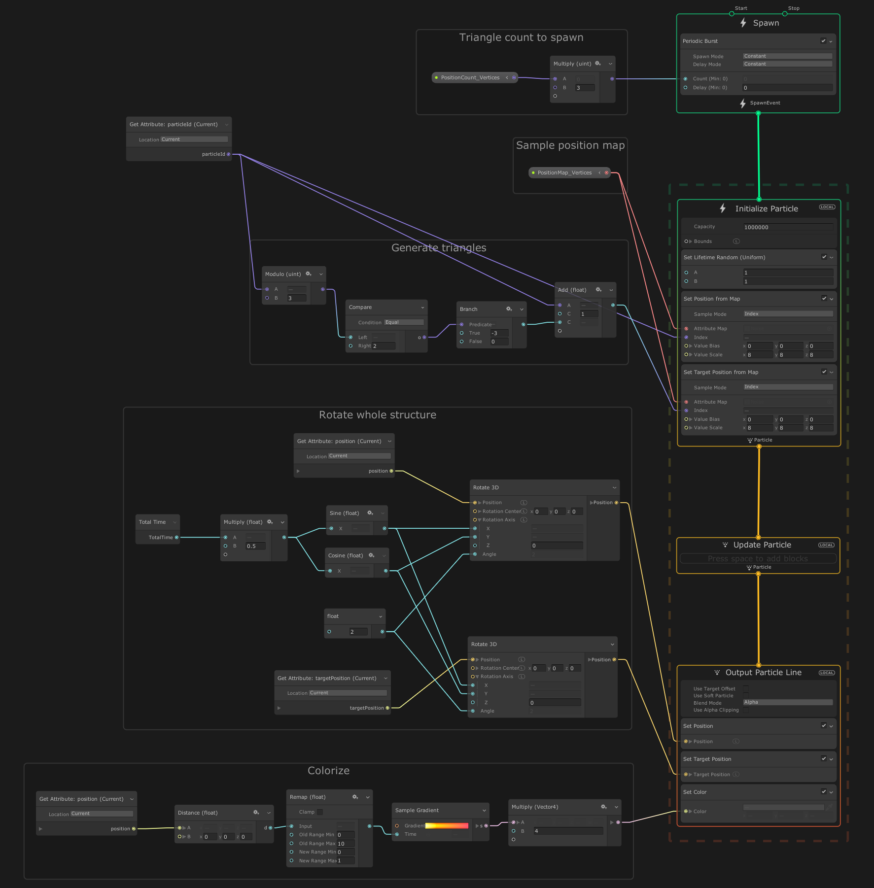

# VegCustomBinder

Unity Visual Effect Graph example on how to create a custom VFX Property Binder.

These binders can be used to pass data to the Visual Effect Graph in order to create customized shapes etc.

My example utilizes HDRP render pipeline. Tested to be working on Unity 23019.3.0f1, HDRP 7.1.6 and Visual Effect Graph 7.1.6.

In the effect I show one way how to create wireframe triangles from point data (In case someone is interested.)

Later updates might break something.

A view of the graph used in this demo:

© 2020 Olli Sorjonen All Rights Reserved
